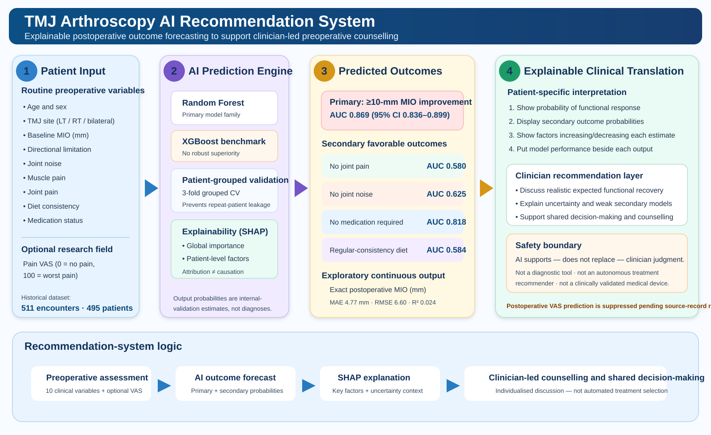

# TMJ AI Studio

TMJ AI Studio is a clinician-facing **research decision-support prototype** for explainable prediction of postoperative outcomes after temporomandibular joint (TMJ) arthroscopy.

The current application is organized around **clinically observable postoperative outcomes**. Wilkes-stage prediction has been removed from the active Streamlit app.

## Recommendation-system infographic

The figure summarizes the intended translational workflow: routine preoperative patient information → patient-grouped machine-learning predictions → SHAP explanation → clinician-led counselling and shared decision-making. The system is designed to **support, not replace, clinical judgment**.

## Current prediction framework

### Primary outcome

**Substantial functional response** — probability of achieving postoperative maximal interincisal opening (MIO) improvement of **>=10 mm**.

Patient-grouped internal validation:
- 466 encounters / 451 unique patients
- 162 responders (34.8%)
- AUC **0.869** (95% CI 0.836-0.899)
- Sensitivity 0.802
- Specificity 0.770
- F1 0.718
- Brier score 0.146

Because this is a change-score endpoint, baseline MIO is mathematically related to the target. Removing preoperative MIO reduced AUC to approximately **0.634**, so the result should be interpreted as prediction of the prespecified >=10-mm endpoint rather than a causal treatment-response mechanism.

### Secondary postoperative outcomes

The same ten routine preoperative clinical variables are used for four secondary exploratory models:

| Outcome | AUC | Interpretation |
|---|---:|---|
| Joint pain absent at last visit | 0.580 | Weak exploratory discrimination |
| Joint noise absent at last visit | 0.625 | Limited exploratory discrimination |
| No medication recorded at last visit | 0.818 | Promising exploratory discrimination; fewer complete records |
| Regular-consistency diet at last visit | 0.584 | Weak exploratory discrimination |

These probabilities are shown with their model-performance context and must not be used as stand-alone treatment recommendations.

### Exploratory exact postoperative MIO

A Random Forest regression estimates last-visit postoperative MIO:
- MAE **4.77 mm**
- RMSE **6.60 mm**
- R² **0.024**

The exact-MIO estimate is therefore labelled **exploratory**. The probability of >=10-mm MIO improvement remains the principal functional-prognosis output.

### Pain VAS improvement prediction

Pain improvement is now an explicit patient-centered output in the app.

- Scale used for the analysis: **0 = no pain, 100 = worst pain**
- Operational improvement endpoint: **last-visit VAS < preoperative VAS** (any reduction)
- Paired VAS cohort: **253 encounters / 251 patients**
- Improved: **27 encounters (10.7%)**
- Patient-grouped AUC: **0.620** (95% CI 0.490-0.738)
- Sensitivity: 0.222
- Specificity: 0.960
- Brier score: 0.124

The interface displays the **predicted probability of postoperative VAS improvement** and a SHAP explanation. Because discrimination is limited and the confidence interval includes 0.50, this output is explicitly labelled exploratory and must not be interpreted as a validated treatment recommendation.

The exact final-VAS regression remains a separate exploratory analysis and is not used as the principal pain output.

## Explainability

The app provides:
- global SHAP feature importance for the functional-response, VAS-improvement, and secondary classifiers;
- patient-level SHAP explanations for the latest assessment;
- plain-language statements describing variables that push predictions toward or away from each favorable outcome.

SHAP explains model attribution and does **not** establish causality or treatment effect.

## Patient-grouped validation

Repeated encounters from the same patient were kept within the same validation fold using 3-fold patient-grouped cross-validation. Displayed metrics are out-of-fold internal-validation estimates from the research analysis.

## Required patient inputs

The functional and secondary models use ten preoperative variables. The VAS-improvement model additionally uses baseline pain VAS:
- age
- sex
- affected site
- preoperative diet
- preoperative medication status
- preoperative MIO
- directional limitation
- joint noise
- muscle pain
- joint pain
- preoperative pain VAS (for the VAS-improvement model)

## Run locally

Install the dependencies from `requirements.txt`, then run:

`streamlit run app.py`

## Scope and legacy files

Legacy files related to the earlier Wilkes severity-stratification experiment may remain in the repository for provenance, but **the current `app.py` does not load, display, or use the Wilkes model**.

## Clinical-use warning

This project is an internally validated research prototype. It requires external validation, recalibration, prospective usability testing, clinical-impact assessment, and appropriate governance before patient-care deployment. It is not a medical device and is not a substitute for clinician judgment.
